FADS Submit program for BlueJ
=============================

Intended audience: Students of *Grundlæggende Algoritmer og Datastrukturer* (FADS), Aarhus University.

In FADS, you have to solve a number of programming tasks along the way.
The programming tasks should be solved in Java using the [BlueJ](https://www.bluej.org/) programming environment.

To solve a programming task, first find the task either in
[Blackboard](https://blackboard.au.dk/webapps/blackboard/execute/launcher?type=Course&id=_66529_1)
or in the [tasks](tasks) directory of this repository.

Then read the task description, download the skeleton Java file, and start coding!

Once you have compiled and tested your solution and got all local testcases passed,
it is time to upload your solution.

You need to use the username and password for the judge system that your TA has hopefully given to you.
If you have technical problems, contact Mathias Rav <rav@cs.au.dk>.

1. Open BlueJ

   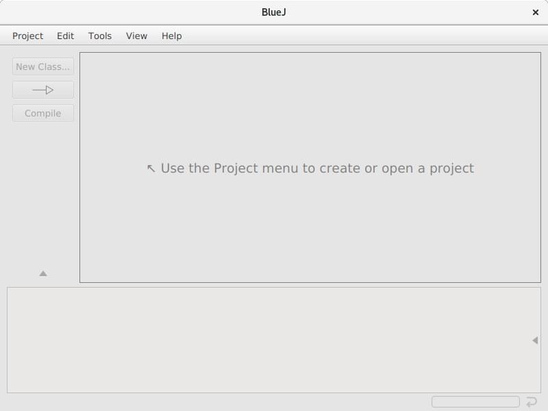

1. Click "New project"

   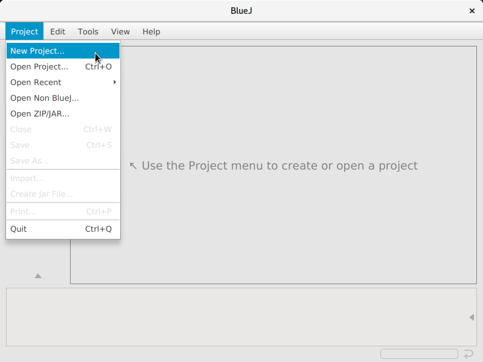

1. Save the new project somewhere

   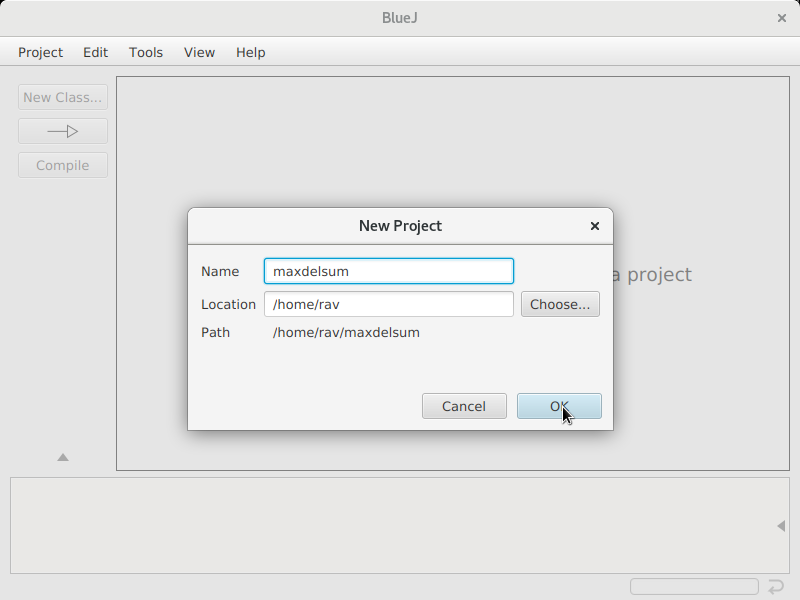

1. In the edit menu, select "Add Class from File..."

   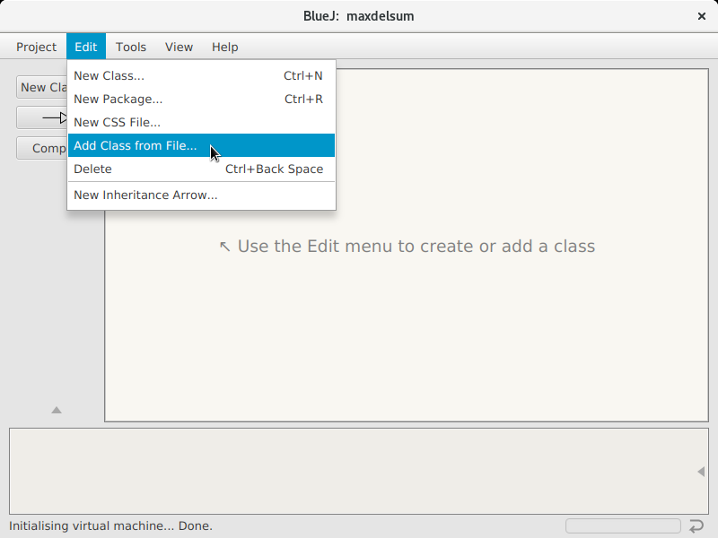

1. Select the skeleton Java file and the Submit.java file for the problem you're solving

   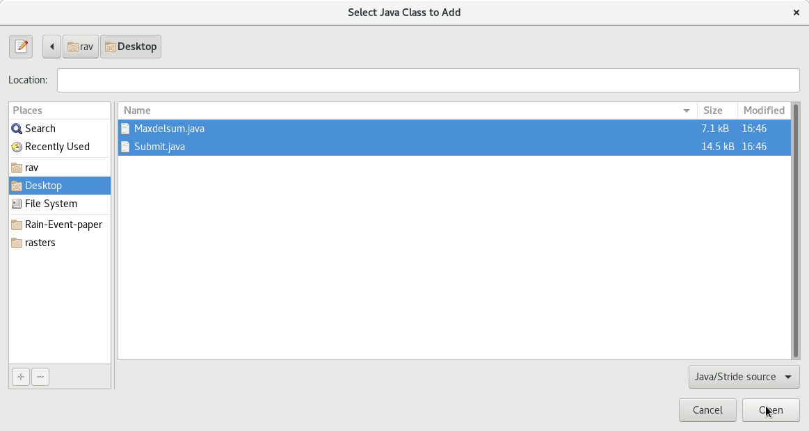

1. Click "Compile" to ensure that the code you're given can compile

   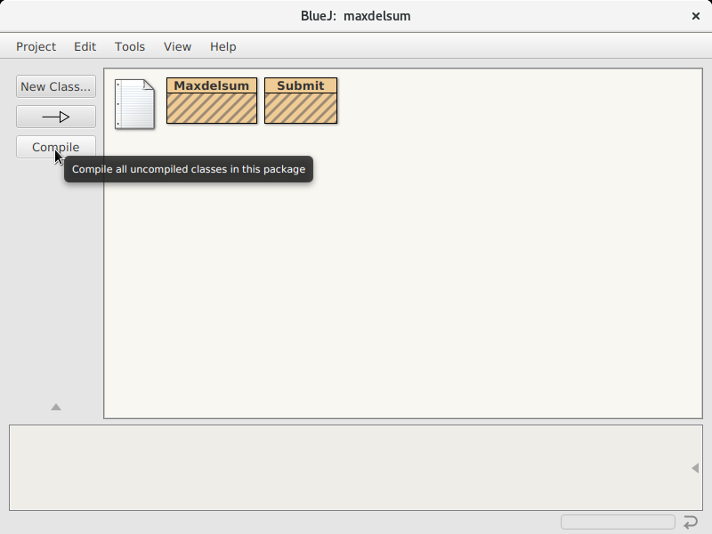

1. Click `testAll()` on `Submit` to see that some or all of the tests currently fail

   

1. Read the test output to see that some tests have `FAIL` written

   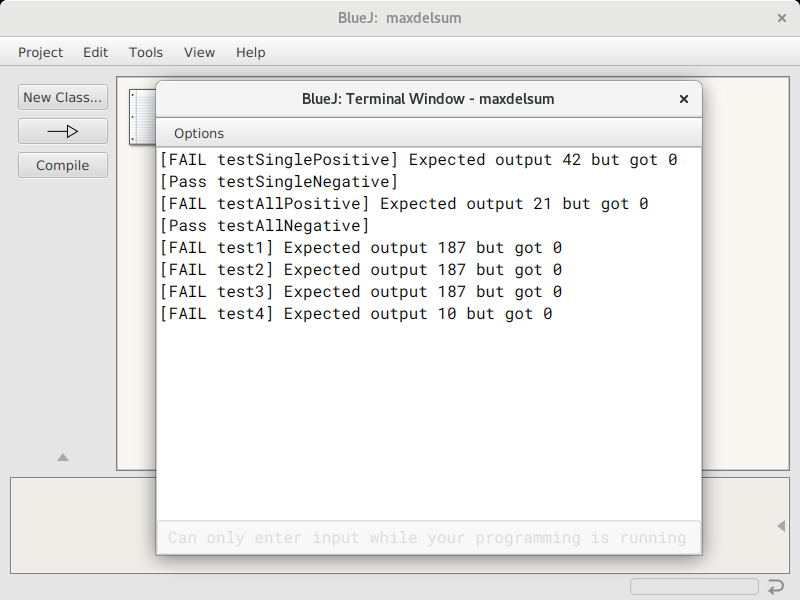

1. Open the editor on the class for this task (that is, not the Submit class, but the class named after the problem you're solving)

   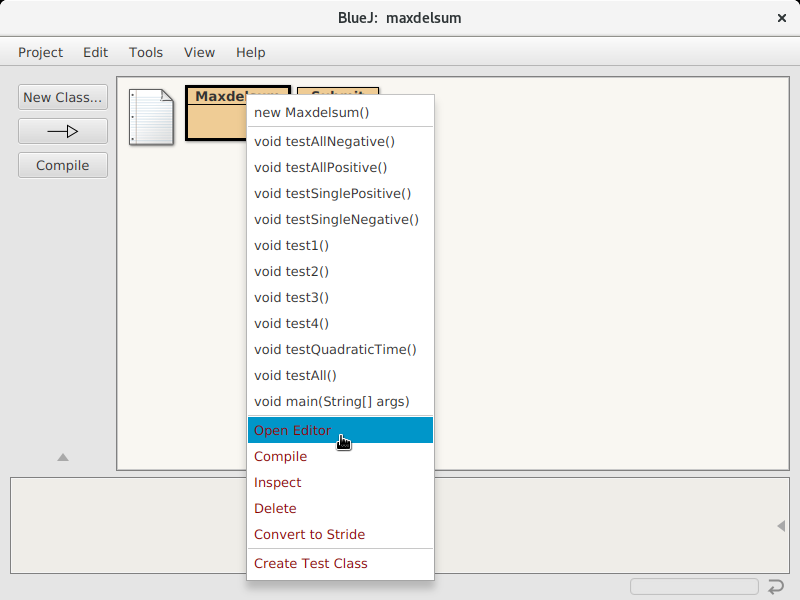

1. Sometimes BlueJ opens the file to a random line. If this happens, scroll up to the top, since you don't have to edit most of the methods in the given file.

   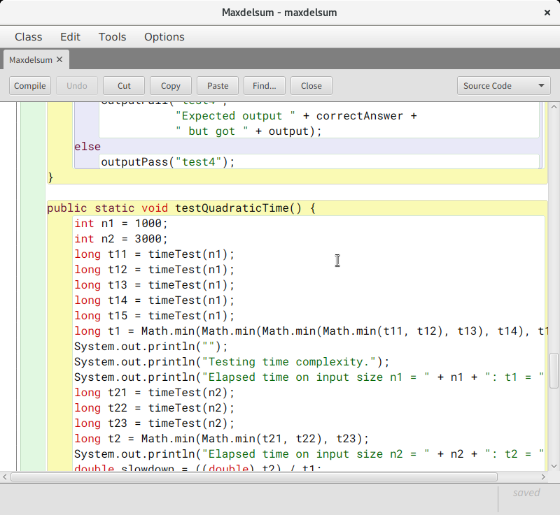

1. At the top of the file, you can now start implementing the algorithm to solve the given task

   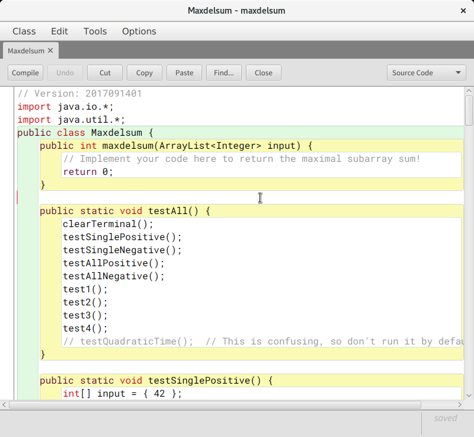

   

1. Click Compile to see if you have any syntax or type errors to correct

   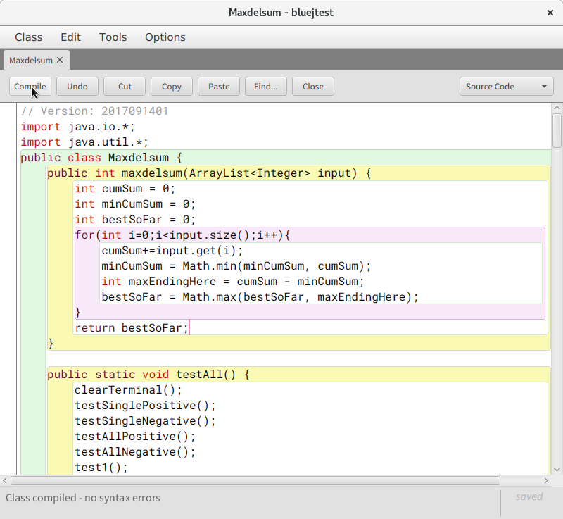

1. If your code compiled successfully, you can now click `testAll()` again to see if the tests pass

   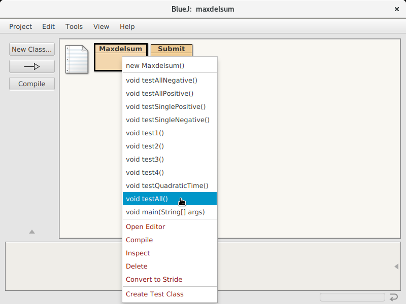

1. If the test output doesn't say `FAIL` anywhere, you're done!

   

1. Right click `Submit` and choose `submit(String task, String username, String password)`

   

1. Enter the username and password your TA gave you, and enter the ID for this
   task. If the task ends in `"-2"`, that means you can get 1 point for a
   correct solution and an additional 1 point for a fast solution.

   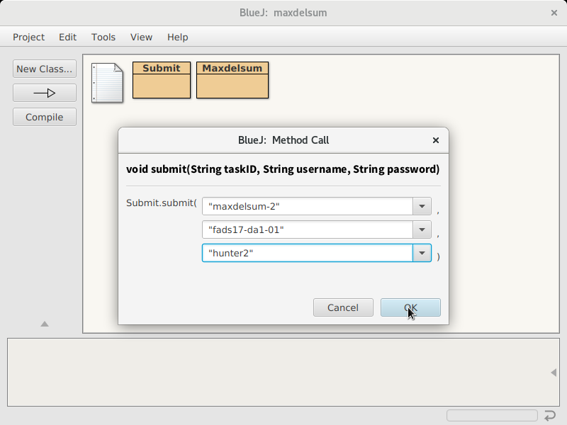

1. Your code will be submitted to the automated judge, and after a while you will see the judgement.
   Remember to switch to the console window of BlueJ if it doesn't appear automatically.

   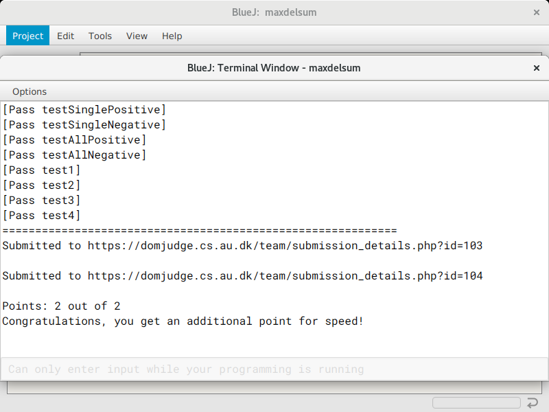
