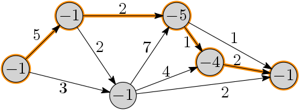

Eastwards travel
================

**Task ID: `"travel-2"`**

In the year 2051, the Danish government has decided to encourage bicycle tourists
to visit its many islands by bicycle by giving cash rewards to island visitors.
Luckily, all islands are quite well-connected via bridges.
Unfortunately, strong westerly winds make it impossible to traverse any bridge (by bike)
east-to-west due to the strong headwind;
thus it is only possible to travel along bridges west-to-east.
Your friend Helge recently bought a bicycle and wants to find the
cheapest route from the westernmost island to the easternmost island.
Travelling along a bridge is associated with a positive cost
(to recharge the bicycle; in the future, all bikes are electric after all).
Visiting an island is associated with a negative cost
(corresponding to the government's island visitor cash reward programme).

Your task is to write a program to find the cheapest strictly eastward route
from the first island to the last island.

The graph is represented by the number of nodes *n*,
each node being an integer between 0 and *n*−1,
such that for all *i* and *j* such that *i* < *j*, node *i* is west of node *j*.
Thus the starting point is the westernmost node 0,
and the ending point is the easternmost node *n*−1.

Along with the number of nodes *n* you are given the graph in adjacency list representation:
An array named `edgeLists` containing *n* arrays containing `Edge` objects,
where `edgeLists[i]` contains the edges out of node *i*.

Each edge `e` in `edgeLists[i]` has three attributes:

* `e.from` (equal to `i`)
* `e.to` (strictly greater than `i`)
* `e.weight`

**Example:** In the following example, the cheapest route has cost −2.

**Concretely,** you must implement a method named
`shortestPath` that accepts the following parameters:

* `int[] nodeWeights` - an integer for each node indicating its code
  (a negative integer)
* `Edge[][] edgeLists` - for each node, an array of `Edge` objects as described above

The method should return an `int` indicating the weight of the shortest path from node 0 to node *n*−1.

Use the skeleton files
<a href="https://github.com/Mortal/csaudk-submitj/raw/master/tasks/travel/Travel.java">
`Travel.java`</a>
and
<a href="https://github.com/Mortal/csaudk-submitj/raw/master/tasks/travel/Edge.java">
`Edge.java`</a>
and the
<a href="https://github.com/Mortal/csaudk-submitj/raw/master/Submit.java">
`Submit` program</a>
inside BlueJ (right click and choose "Save link as").

**Input constraints:**

  * Number of nodes: 1 ≤ N ≤ 200000
  * Number of edges: 1 ≤ M ≤ 200000

**Scoring:**

  * 1 point for correct implementation
  * 1 additional point for fast implementation

For the first point, an O(N·M) algorithm is fast enough.
For the additional point, an O(N) algorithm is required.

**Hint for the fast solution:** Modify DAG-Shortest-Paths to include node weights.
